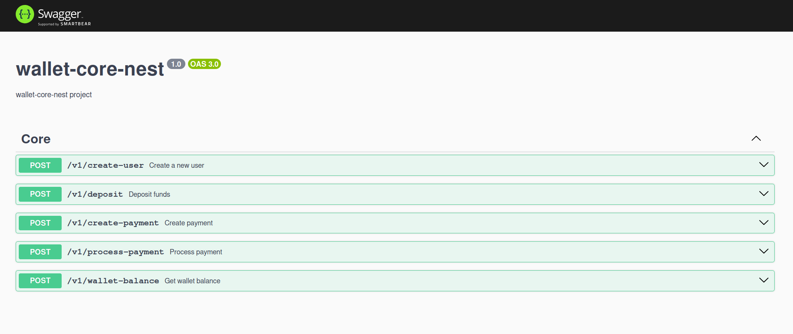
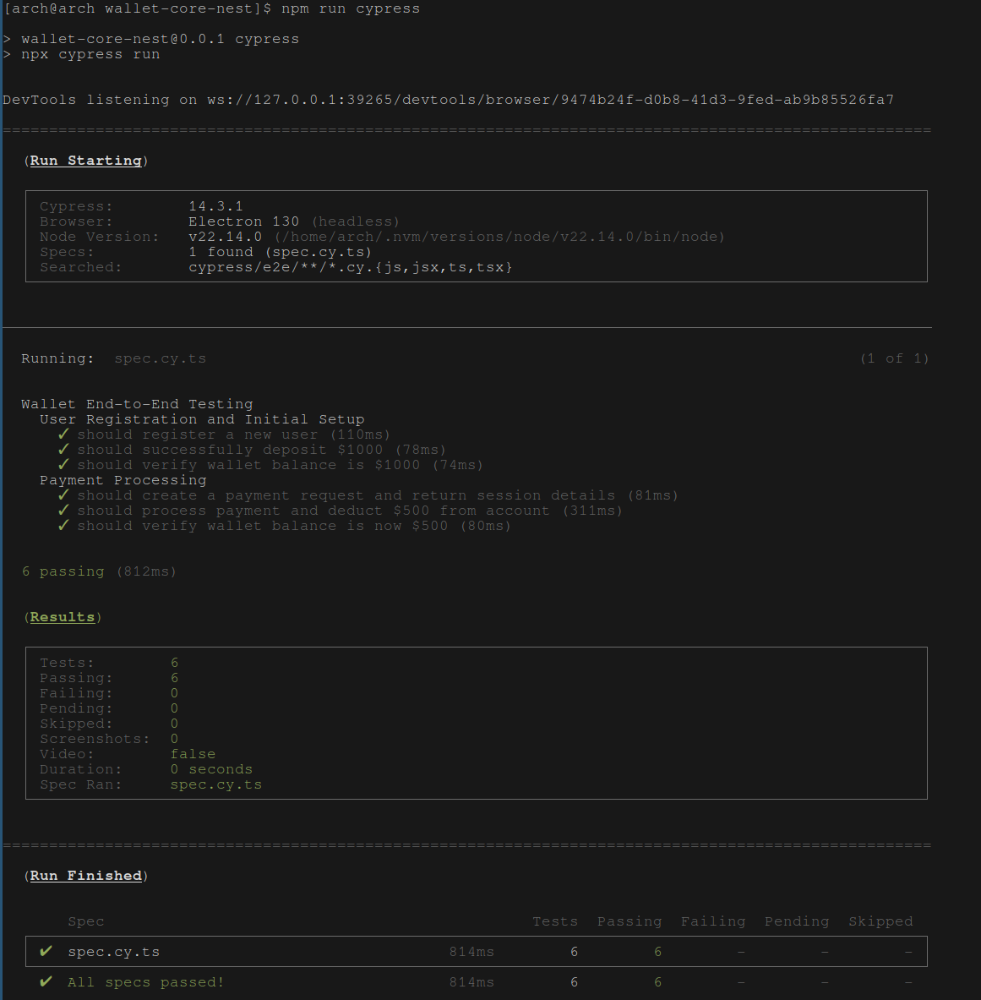
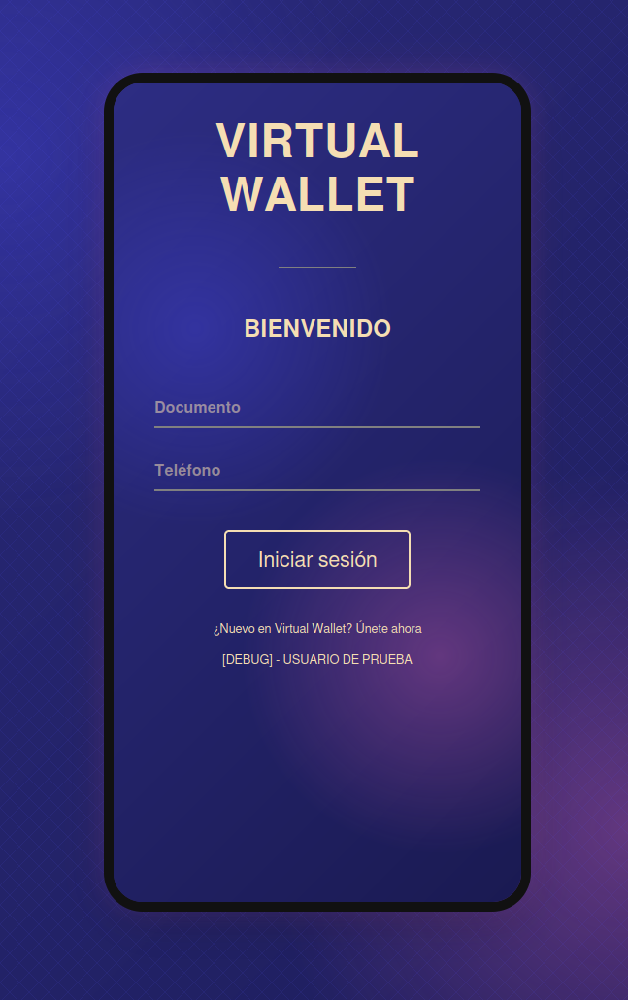
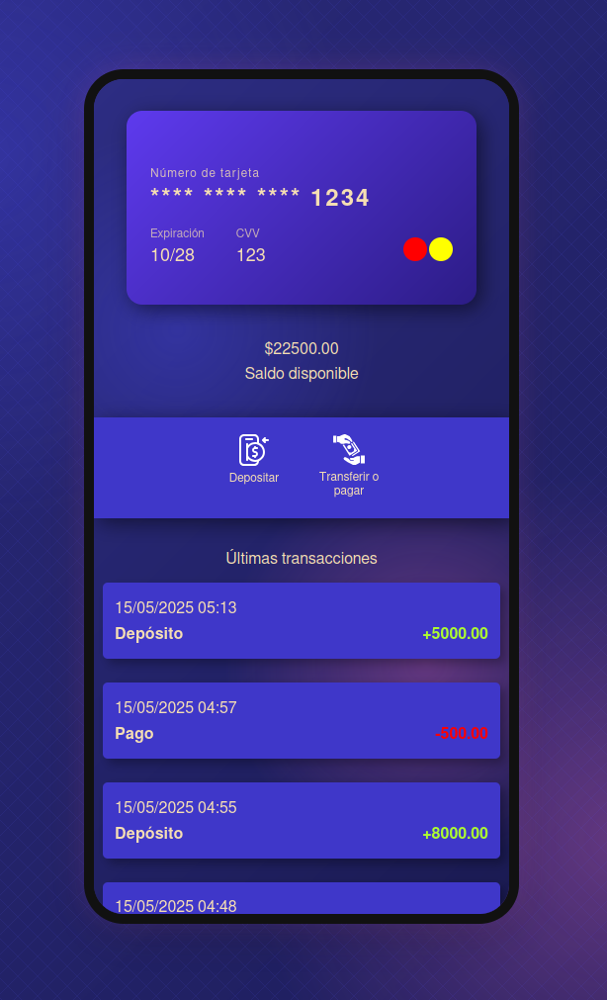
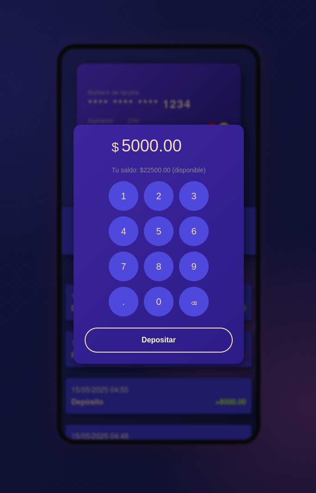

# virtual-wallet-monorepo - Prueba Técnica

Este proyecto fue creado con el fin de cumplir con la prueba técnica.

### Acceso Rápido
- **[Wallet Core NestJS REST Only](/wallet-core-nest)** : Proyecto en NestJS que implementa la lógica principal.  
- **[Wallet Frontend React/NextJS](/wallet-frontend-next)** : Proyecto en NestJS que implementa la lógica principal.  
- **[Terraform](/terraform)** : Configuración de infraestructura para despliegue en VPS (Vultr).  
- **Wallet Hybrid SOAP-REST** : *(Descartado)* No se incluyó PHP/SOAP por que no era requerido. Si es necesario, contactar por correo.

## Vista previa en vivo

[Vista previa de Swagger](https://wallet-standalone-api.asciicrawler.com/api)

[Vista previa de Frontend](https://wallet-frontend-next.asciicrawler.com)

## Capturas de pantalla

