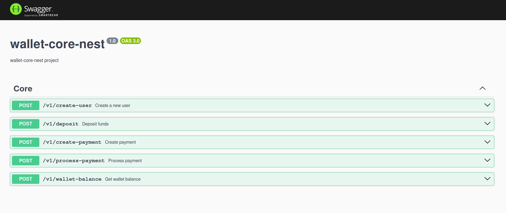

# wallet-core-nest

This project was created for a technical test.
Standalone api - NO SOAP/LARAVEL SERVER

## Features

- **NestJS** - A progressive Node.js framework for building efficient and scalable server-side applications.
- **MongoDB** - NoSQL database for flexible, scalable data storage.
- **Jest Testing** - Comprehensive unit and integration testing.
- **Cypress E2E Testing** - Robust end-to-end testing framework.
- **Swagger Support** - Automated API documentation.
- **Zod Validations** - Type-safe schema validation.
- **Docker support** - Simple Support for Docker

## Screenshots



## Live preview

[Swagger live preview](https://wallet-standalone-api.asciicrawler.com/api)

## Prerequisites

- Node.js (v18+ recommended)
- MongoDB (v6+ recommended)
- npm

## Installation

```bash
# Install dependencies
npm install

# Set up environment variables
cp .env.example .env

# Run with docker
sh rundocker.sh

# Run with Node
npm run start
```

## License
Distributed under MIT LICENSE. See LICENSE for more information.