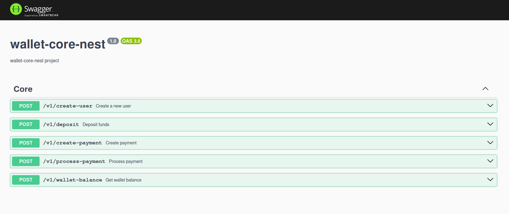
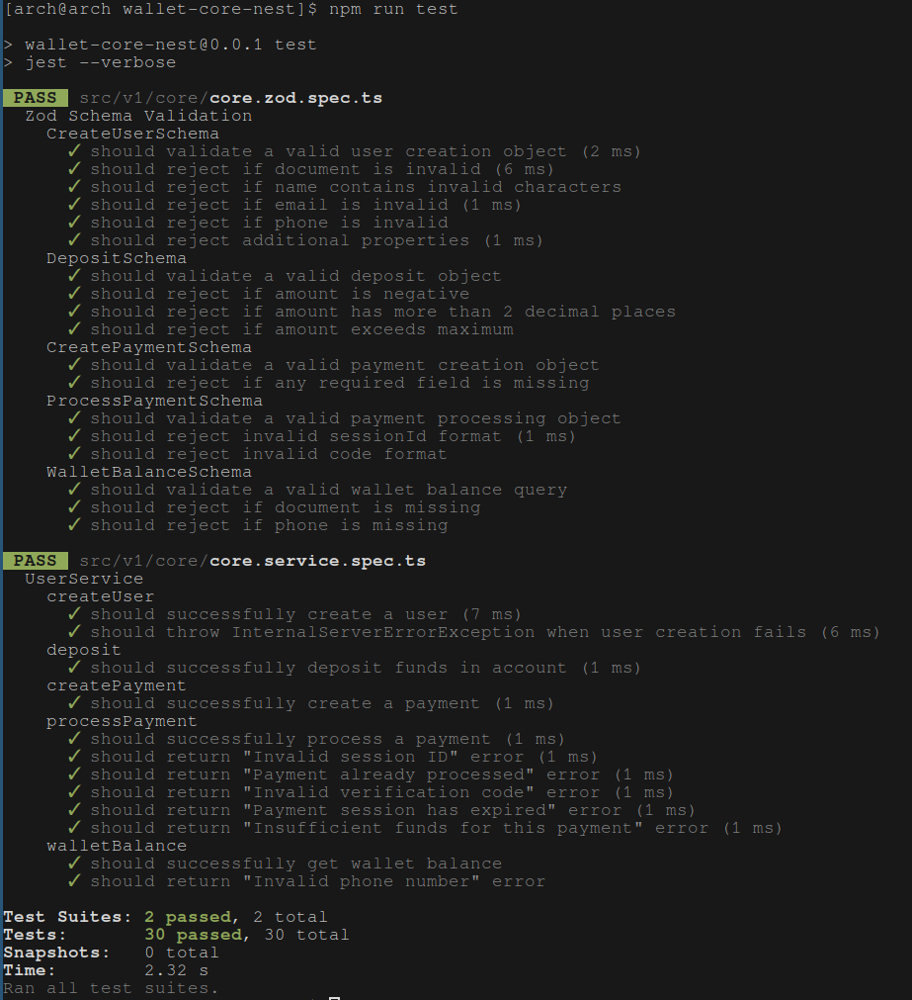
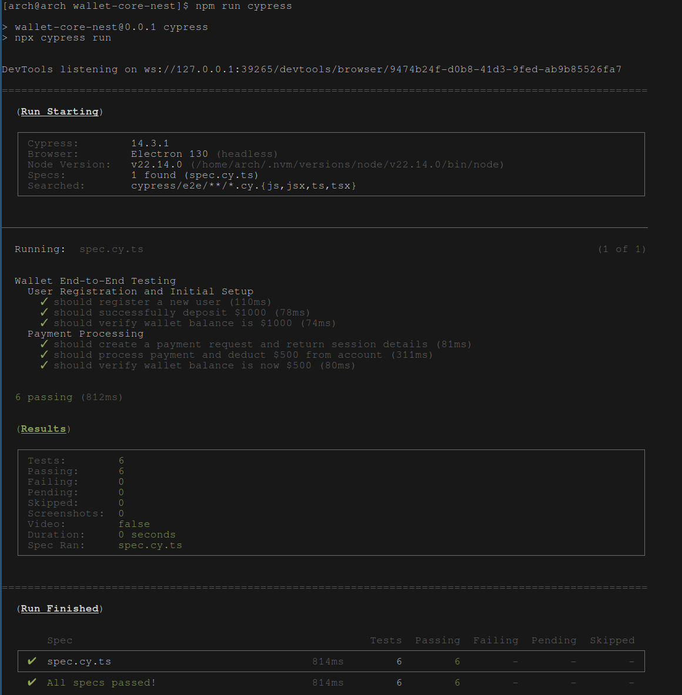

# wallet-core-nest

Este proyecto fue creado para una prueba técnica.  
API independiente - SIN SERVIDOR SOAP/LARAVEL

## Características

- **NestJS** - Un framework progresivo de Node.js para construir aplicaciones eficientes y escalables del lado del servidor.
- **MongoDB** - Base de datos NoSQL para almacenamiento de datos flexible y escalable.
- **Pruebas con Jest** - Pruebas unitarias e integrales exhaustivas.
- **Pruebas E2E con Cypress** - Framework robusto para pruebas de extremo a extremo.
- **Soporte para Swagger** - Documentación automática de la API.
- **Validaciones con Zod** - Validación de esquemas con seguridad de tipos.
- **Soporte para Docker** - Soporte sencillo para Docker.

## Capturas de pantalla





## Vista previa

[Vista previa de Swagger](https://wallet-standalone-api.asciicrawler.com/api)


## Requisitos

- Node.js (se recomienda v18+)
- MongoDB (se recomienda v6+)
- npm

## Instalación

```bash
# Instalar dependencias
npm install

# Configurar variables de entorno
cp .env.example .env

# Ejecutar con Docker
sh rundocker.sh

# Ejecutar con Node
npm run start