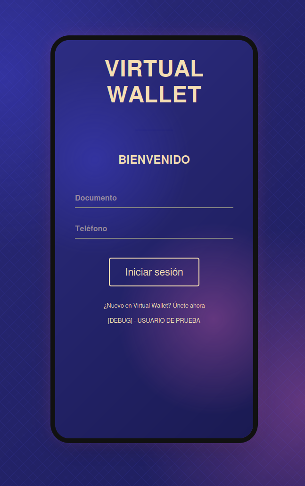
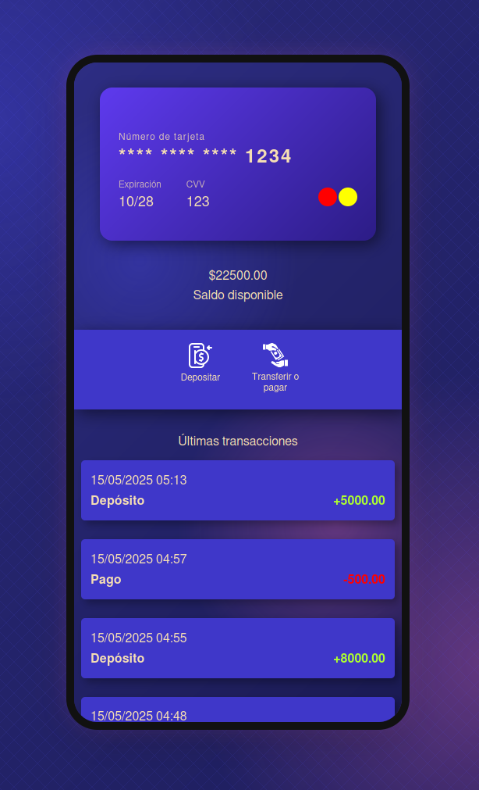
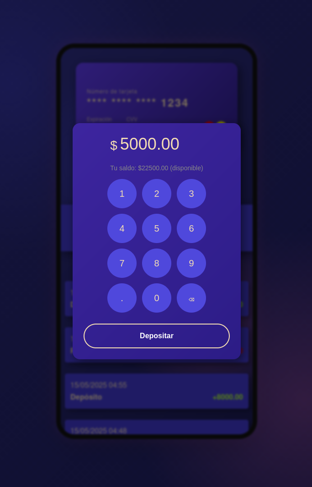

# wallet-frontend-next

Este proyecto fue creado para una prueba técnica.  
Wallet frontend

## Vista previa

[Vista previa de Frontend](https://wallet-frontend-next.asciicrawler.com)

## Capturas de pantalla





## Requisitos

- Node.js (se recomienda v18+)
- npm

## Instalación

```bash
# Instalar dependencias
npm install

# Ejecutar con Node
npm run dev

# Compilacion
npm run build

# Ejecutar produccion PORT 10001
npm run serve